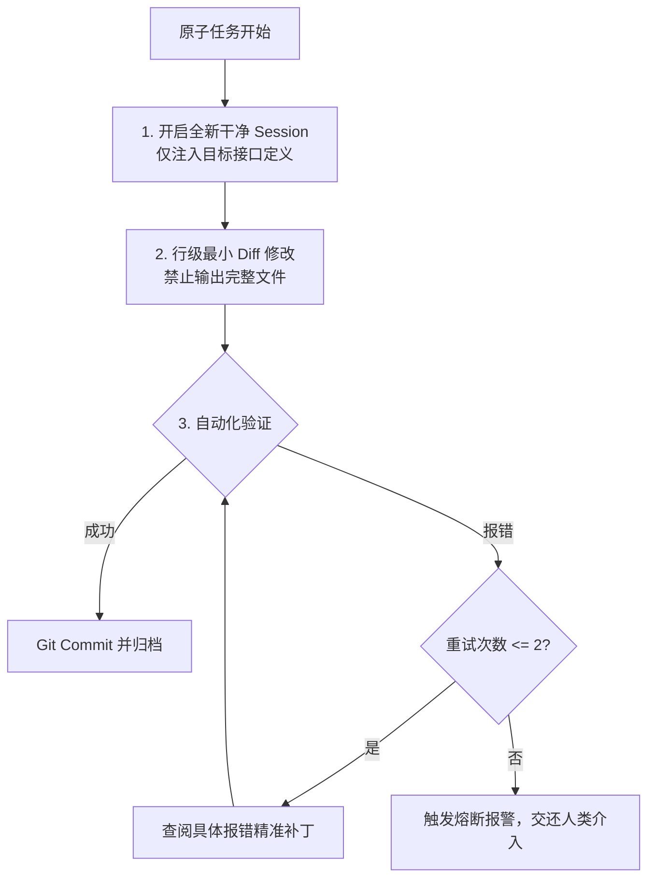
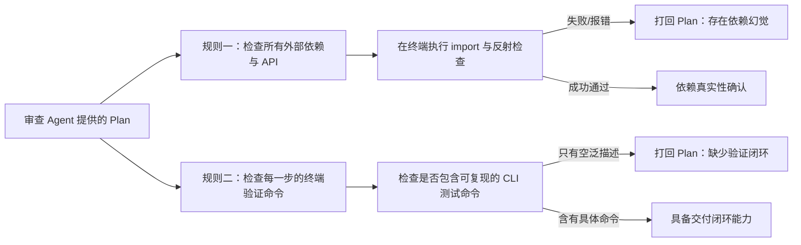

# AI Agent 工程化落地铁律：省 Token、保一致、辨幻觉实战手册

> **核心目标**：将不确定的 LLM 概率生成行为，收敛为高确定性、低成本、可审计的软件工程交付流程。

---

## 目录
1. [第一法则：省 Token（成本与延迟控制）](#第一法则省-token成本与延迟控制)
2. [第二法则：保一致（设计与交付对齐）](#第二法则保一致设计与交付对齐)
3. [第三法则：辨幻觉（可靠性与真实性审查）](#第三法则辨幻觉可靠性与真实性审查)
4. [第四法则：规则载入与硬约束门禁体系](#第四法则规则载入与硬约束门禁体系)
5. [工程落地标准作业程序 (SOP) 与执行模板](#工程落地标准作业程序-sop-与执行模板)

---

## 第一法则：省 Token（成本与延迟控制）

Token 消耗过大主要由三大隐形陷阱导致：**历史上下文滚雪球**、**冗余代码输出**、**错误尝试死循环**。必须通过结构化手段进行物理阻断。



### 1. 单功能单会话（即时新建对话）
*   **问题根源**：LLM 计费基于每轮全量传入的历史上下文（Prompt Input Tokens）。当对话推进到 20 轮以上，一次只改动 1 行代码的微小请求，也需要把前 19 轮累计的上万 Token 重复发送并计算费用。
*   **操作规范**：
    *   **原子任务切片**：以“一个模块”、“一个接口”或“一个 Bug 修复”为单一会话生命周期。
    *   **即时终结与上下文转移**：当前任务的代码通过测试并完成 Git Commit 后，**立刻关闭当前 Session，新开对话**。
    *   **上下文注入白名单**：新会话严禁粘贴过往大段聊天记录，仅通过 `@` 或精准参数挂载该功能必需的契约定义（如 `types.ts`、数据模型接口或 OpenAPI 文档）。

### 2. 行级局部修改（禁整文件覆写）
*   **问题根源**：模型的输出 Token 成本比输入更昂贵，且输出速度直接受物理吞吐（TPS）限制。为一个仅需调整 2 行条件判断的文件全量重写 600 行代码，不仅浪费几十倍 Output Tokens，还会带来代码格式被破坏、注释丢失的副作用。
*   **操作规范**：
    *   **工具强制约束**：优先使用类似 `replace_file_content` 这类必须指定起始行号、精确目标文本、替换文本的微创工具。
    *   **禁止占位输出**：禁止 Agent 输出附带大片上下文的完整函数；只输出 Diff 片段或精准定位点。
    *   **极简原则 (Ponytail & YAGNI)**：只实现解决问题所需的最短变更（Shortest Working Diff），禁止 Agent 顺手“重构”邻近代码。

### 3. 失败上限 2 次即停（防死循环熔断）
*   **问题根源**：当 Agent 遇到深层架构冲突或未知环境故障时，极易陷入“生成补丁 -> 运行报错 -> 盲猜继续改 -> 报错扩散”的死循环，在 10 分钟内耗尽全部配额。
*   **操作规范**：
    *   **计数器与熔断机制**：为同一个测试错误建立计数器。当同类报错连续出现 **2 次** 且无法自行修复时，**强制停止执行任何写工具与终端命令**。
    *   **报警输出结构**：熔断触发后，Agent 必须以统一格式汇报：
        1. 遇到的核心错误现象与终端堆栈；
        2. 前 2 次修复尝试的假设与失败原因；
        3. 怀疑的外部依赖/设计矛盾点，交由人类决策。

---

## 第二法则：保一致（设计与交付对齐）

AI 产生执行偏差的本质是“注意力衰减”与“口头承诺缺乏可执行性”。解决之道在于**物理文件锚定**与**契约测试驱动**。

### 1. Plan 必须落成带有 Checkbox 的本地文档
*   **操作规范**：
    *   **严禁口头约定**：任务方案不可仅仅存在于聊天气泡中，必须由 Agent 在本地项目目录中写入一份具体的 Plan 工件（如 `task_plan.md`）。
    *   **颗粒度约束**：每个步骤必须是可拆解的原子操作，统一使用 Markdown Checkbox（`- [ ]` / `- [x]`）呈现。
    *   **状态同步回写**：Agent 在完成某个子步骤并通过测试后，必须立即使用工具回写该文档，将对应的任务框勾选为 `[x]`。此举不仅保证进度透明，还能持续校准 Agent 下一步的注意力焦点。

```markdown
<!-- task_plan.md 示例规范 -->
# 支付回调重试机制改造实施方案

## 交付物与验收清单
- [x] 1. 定义重试策略数据结构与状态枚举 (`models/payment.py`)
- [ ] 2. 实现指数退避算法与队列推送服务 (`services/retry_queue.py`)
- [ ] 3. 编写幂等性与并发锁校验单元测试 (`tests/test_retry.py`)
- [ ] 4. 跑通全量测试并回归验证旧版支付主流程
```

### 2. 接口/测试契约先行驱动 (Spec/Test-First)
*   **操作规范**：
    *   **步骤一：冻结契约**。先定义好不可变的数据结构、API Schema 或函数签名（如 TypeScript Interface、Python Pydantic 实体）。
    *   **步骤二：测试先行**。在编写任何业务实现代码前，强制先生成验证用例（Unit Test）。明确给定：
        *   标准输入与期望输出；
        *   边缘用例（边界值、空数据、超限数据）；
        *   预期的异常抛出。
    *   **步骤三：以“测试通过”作为唯一交付标准**。Agent 不得用“我已经写完了”作为完成标志，必须终端运行对应测试并打印绿色 PASS 结果，才算完成这一节点。

---

## 第三法则：辨幻觉（可靠性与真实性审查）

对 Agent 方案的审查，必须摒弃对其自然语言流畅度的信任，建立**基于机器确定性**的核验门禁。



### 1. 凡新增依赖必先终端验证
*   **幻觉模式**：
    *   伪造三方库名（如凭空想象出 `fastapi-rate-limit-redis` 并加入 `requirements.txt`）；
    *   混淆 API 版本（例如在旧版本 SDK 中调用最新版才有的异步方法，或调用已被弃用的配置参数）。
*   **审查与防御机制**：
    *   只要 Plan 中出现新的第三方包或底层框架的高级方法，**在批准方案前，强制要求 Agent 先在终端运行一行探针命令**：
        ```bash
        # Python 探针：检查模块是否存在及是否有该方法
        python -c "import module_name; print(hasattr(module_name, 'target_method'))"

        # Node.js 探针：查询 npm 官方真实注册信息
        npm view package_name version
        ```
    *   如果命令报错或找不到包，直接打回 Plan，拒绝继续编写后续业务逻辑。

### 2. 凡步骤无终端测试命令即视作未完成
*   **幻觉模式**：
    *   **伪实现（Stub Implementations）**：在核心逻辑处留有 `// TODO: handle concurrency` 或空 pass 语句；
    *   **假闭环**：Plan 最后写着“进行安全性与回归验证”，但没有任何具体实施脚本，仅在对话中宣称“已在本地验证无误”。
*   **审查与防御机制**：
    *   Plan 中的每一个功能步骤，必须对应附带一条**可直接在终端无交互执行的验证命令**。
    *   **验收门禁标准**：
        *   ❌ **无效说明**：“启动服务并在浏览器里点一下测试”。
        *   ✅ **有效命令**：`pytest tests/test_payment.py::test_concurrent_lock -v`。
        *   ✅ **有效命令**：`curl -s -o /dev/null -w "%{http_code}" -X POST http://localhost:8000/api/v1/retry` 返回 `200`。
    *   若缺少确定性的测试命令，判定该方案为“不可执行的设计方案”，不予进入编码阶段。

---

## 第四法则：规则载入与硬约束门禁体系

### 1. 为什么纯 Prompt 约束无法达到 100% 依从？
- **注意力稀释（Lost in the Middle）**：规则堆砌越多，中间项被忽略的概率呈指数上升。
- **预训练先验冲突**：模型潜意识倾向于选择在开源库中最常见的通用写法，而非用户特定规则。
- **负向指令衰减**：“不要 X”的语句反而将注意力吸引到了 X 上。

### 2. 软约束 vs 硬约束架构矩阵

| 约束类型 | 软约束（Prompt / Markdown） | 硬约束（Tool / Hook / Sandbox） |
| :--- | :--- | :--- |
| **文件修改范围** | 在规则中声明“禁止修改完整文件” | **工具屏蔽**：仅暴露局部替换 API（如 `replace_file_content`），无全量覆写权限。 |
| **代码格式规范** | 在 Prompt 中叮嘱缩进与命名风格 | **自动化门禁**：改动后自动触发 `prettier` / `black` 或 Git pre-commit hook。 |
| **破坏性操作阻断**| 在规则中写“禁止删除数据库或执行危险命令” | **系统级沙箱**：执行策略设为 `request-review` 或在 Docker Sandbox 中隔离运行。 |

---

## 工程落地标准作业程序 (SOP) 与执行模板

在项目根目录设立 `.cursorrules`、`GEMINI.md` 或 `AGENTS.md` 时，可直接写入以下系统约束规则：

```markdown
# AGENT RUNTIME CONSTRAINTS

## 1. Cost & Context Control
- Strict single-task session: Complete the scoped task, commit changes, and prompt the user to start a new chat.
- Surgical edits only: Use precise chunk replacements with line numbers. Full file overwrites are forbidden.
- Circuit breaker: Max 2 consecutive self-healing attempts for the same runtime/test error. Escalate immediately after.

## 2. Plan & Consistency Protocol
- Write and persist a `task_plan.md` with explicit checkboxes `- [ ]` before modifying source code.
- Contract-first: Define schemas and unit tests before writing business logic.
- Real-time tracking: Update `task_plan.md` with `- [x]` after each step passes automated tests.

## 3. Hallucination Guardrails
- Probe external dependencies: Run terminal checks (e.g., package registry queries, reflection tests) before adding new libraries.
- Executable verification: Every plan step must be accompanied by an exact CLI test command (e.g., `pytest`, `npm test`, `curl`). Manual/visual checks are not accepted as completion criteria.
```
