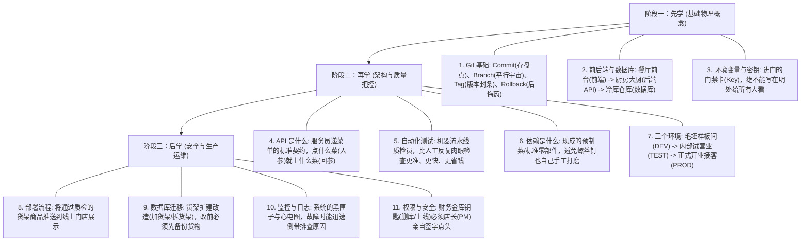

# PM 技术词典与边做边学手册 (GLOSSARY.md)

> **使用说明**：记录开发过程中遇到的核心概念，用大白话和生活类比拆解，供 PM 在实际项目中持续精进。

---

## 一、 PM 判断 Agent 是否靠谱的“三个信号”（黄金验收法则）

> **铁律：三个信号缺任意一个，立刻打回，拒绝验收！**

1. 🟢 **测试全绿**：所有单元测试与集成测试必须在终端打印绿色 PASS，没有挂起或忽略。
2. 🟢 **亲手跑通演示**：按 Agent 提供的“操作步骤”，PM 自己在浏览器或终端里亲自点一遍，能够完整复现需求。
3. 🟢 **改动范围匹配需求**：改动的文件清单只涉及目标模块，没有擅自“顺手重构”无关的代码。

---

## 二、 PM 边做边学渐进式路线图

---

## 三、 PM 审阅代码 Diff 的“三件事”（无需看懂具体语法）
每次 Agent 提交代码修改时，PM 只需要核对三点：
1. **改了哪些文件？**（是否碰了认证、支付或核心库等敏感文件？）
2. **增删了多少行？**（改一个小功能却增加了 1000 行，说明有过度设计或偷偷造轮子）
3. **有没有无关改动？**（有没有顺手格式化、删除无关注释或擅自修改公共配置？）

---

## 四、 核心术语大白话速查表

| 技术术语 | 白话解释 | 生活类比 |
| :--- | :--- | :--- |
| **Git Commit** | 保存一次确定的代码修改版本。 | 单机游戏的**手动存档**。 |
| **Git Tag** | 给某个重要的存档打上永久标记。 | 出厂商品贴上 **“合格证与版本号标签”**。 |
| **Pre-commit** | 在按下保存键之前自动执行的质检门禁。 | 登机前的**安检扫描仪**（查出打火机直接拒绝登机）。 |
| **API (接口)** | 两个不同程序之间约定的交流暗号。 | 餐厅的**点菜小票**。 |
| **CVE 漏洞** | 全球公开安全漏洞库中记录的已知系统后门。 | 锁具被公布了**万能钥匙破解法**。 |
| **Prompt Injection** | 恶意用户在输入框或网页里夹带指令，诱骗 Agent 变节。 | 间谍在普通信件里夹带**催眠暗号**诱骗警卫。 |
| **Surgical Diff** | 只修改目标几行代码，不影响周边环境。 | 医生做**微创外科手术**（只开小切口，不伤大动脉）。 |
| **GetFileAttributesEx** | Windows 系统用来核对文件或文件夹是否存在、查看属性的底层办事员。 | 门卫核对**身份证与进门登记簿**。 |
| **绝对路径 vs 相对路径** | 包含完整盘符位置的完整门牌号（绝对），与仅写省份/小区的半截简称（相对）。 | **“北京市朝阳区某路某号”（完整地址）** vs **“隔壁胡同”（离开当前语境就找不着）**。 |
