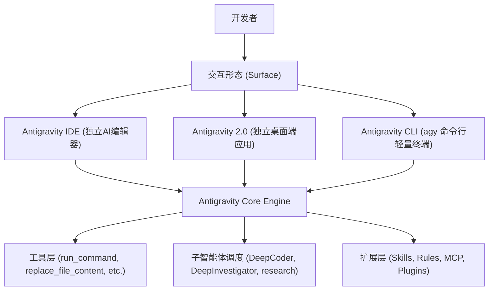

# 反重力 (Antigravity) 完整使用与高效实战指南

> **核心定位**：Antigravity（AGY）是 Google DeepMind 团队构建的 AI-First 智能体研发与结对编程环境，基于 Gemini 大模型原生能力设计，兼具自主编码、环境交互与复杂工具链编排。

---

## 目录
1. [一、 体系架构与运行形态](#一-体系架构与运行形态)
2. [二、 交互控制：Slash 命令与上下文引用](#二-交互控制slash-命令与上下文引用)
3. [三、 定制系统体系 (Customization System)](#三-定制系统体系-customization-system)
4. [四、 底层识别与载入机制深度解析](#四-底层识别与载入机制深度解析)
5. [五、 高效 Agent 开发实战模式 (Karpathy & Ponytail)](#五-高效-agent-开发实战模式-karpathy--ponytail)
6. [六、 典型工作流场景实战](#六-典型工作流场景实战)
7. [七、 进阶配置与安全控制](#七-进阶配置与安全控制)

---

## 一、 体系架构与运行形态

Antigravity 拥有三种主要交互界面，底层共享同一套核心智能体运行时引擎：



### 1. 桌面端 (Antigravity 2.0)
- **Chat Canvas**：主对话与执行流看板。
- **Auxiliary Pane (辅助看板)**：实时查看子智能体（Subagents）、后台任务（Background Tasks）、生成的工件（Artifacts）、改动的文件差异（Files Changed）及运行终端。
- **Scheduled Tasks**：内置 Cron 定时与单次延迟调度器。

### 2. 命令行客户端 (`agy`)
- 启动：在终端直接运行 `agy`。
- 退出：`Ctrl+D Ctrl+D` 或输入 `/exit`。
- 配置路径：`~/.gemini/antigravity-cli/settings.json`。

---

## 二、 交互控制：Slash 命令与上下文引用

### 1. 常用 Slash 命令速查

| 指令 | 适用场景 | 底层行为机制 |
| :--- | :--- | :--- |
| `/plan` | 复杂任务规划 | 强制先出技术设计方案工件（Implementation Plan），经用户确认后再动手修改代码。 |
| `/boost` | 深度攻坚与高难度排错 | 启动双轨子智能体调度模式，由 `DeepCoder` 或 `DeepInvestigator` 独立沙箱攻坚，层层验证。 |
| `/grill-me` | 需求对齐与架构质询 | 智能体转入“面试官/架构师”模式，主动反问边界条件和潜在权衡，消除模糊暗设。 |
| `/goal` | 长程无干预执行 (Overnight) | 开启高自主性执行循环，直至任务彻底验证通过，不轻言放弃。 |
| `/browser` | 网页抓取与交互测试 | 挂载浏览器自动化驱动，执行网页端到端测试与数据提取。 |
| `/schedule` | 定时巡检与计划任务 | 创建后台 Cron 定时任务或延迟执行任务。 |

### 2. `@` 符号精准注入上下文
避免大段黏贴代码或日志，输入 `@` 可直接关联：
- `@<文件/目录>`：将代码文件或模块结构注入上下文（支持相对路径与绝对路径）。
- `@terminal`：直接挂载最近的终端输出或执行报错日志。
- `@rules`：即时指定生效的项目规范。
- `@mcp`：挂载特定的外部工具服务能力。

---

## 三、 定制系统体系 (Customization System)

Antigravity 采用**渐进式暴露（Progressive Disclosure）**机制：不将所有规则全部灌入 Prompt，而是根据任务动态挂载。

### 1. 定制维度对比

| 类型 | 文件/目录路径 | 作用范围 | 适用场景 |
| :--- | :--- | :--- | :--- |
| **Rules** | `GEMINI.md` 或 `.agents/rules/*.md` | 层级式生效 | 团队编码风格、禁止使用的 API、语言规范。 |
| **Skills** | `.agents/skills/<name>/SKILL.md` | 按需挂载 (On-Demand) | 复杂多步骤 Runbook（如发布扩展、CI/CD 部署、动画规范）。 |
| **MCP** | `mcp_config.json` 或 `mcp/<server>/` | 工具协议扩展 | 连接外部数据库、GitHub API、第三方私有系统。 |
| **Plugins** | `plugins/<name>/plugin.json` | 模块化捆绑包 | 打包跨项目共享的 Skills、Rules 与 MCP 配置组合。 |

### 2. 规则优先级顺序（由高到低）
1. **工作区根目录规则**（`.agents/rules/`，当前目录向上回溯至 Git 根目录）
2. **项目级声明配置**（`skills.json`, `plugins.json`）
3. **全局用户配置**（`~/.gemini/config/`）
4. **内置系统技能**（Built-in Skills）

---

## 四、 底层识别与载入机制深度解析

针对开发者最关心的两个底层机制：“如何识别/载入”与“是否 100% 遵守”：

### 1. 载入原理：分级索引与渐进暴露（Progressive Disclosure）
Antigravity 绝不是启动时就把所有文档无脑塞进上下文：
1. **静态规则（Rules）**：
   - 目录回溯算法：从当前打开文件所在路径，逐级向上遍历至 Git 根目录加载 `GEMINI.md`。
   - 路径命中加载：配置有路径匹配条件的规则，只在 Agent 读取对应目录文件时挂载。
   - 文件指纹去重：基于规范化绝对路径，杜绝重复注入。
2. **技能库（Skills）**：
   - **阶段一（常驻索引）**：仅读取 `SKILL.md` 的 YAML Frontmatter（`name` 与 `description`），常驻在系统提示词索引表中，Token 损耗微乎其微。
   - **阶段二（动态挂载）**：用户需求命中描述时，Agent 自主通过 `view_file` 调取完整文档；用完即弃。
3. **MCP 扩展工具**：
   - **Eager 工具**：高频基础工具（读写改查命令），Schema 全量常驻。
   - **Lazy 工具**：成百上千个第三方 API，启动仅声明路由函数，运行时按需拉取对应 API Schema。

### 2. 依从性真相与工程防御
- **依从性现实**：大模型本质是概率推断机器，纯文本 Prompt 无法做到 100% 遵守。规则条数越多，注意力越稀释。
- **双层防御策略**：
  - **软约束（Prompt/Rules）**：指导业务偏好、代码范式、架构决策。
  - **硬约束（Tool/Sandbox/Hooks）**：将核心红线工程化。例如禁止整文件覆写不能只靠 Prompt 提醒，而是工具层直接剥离全写能力、仅提供基于行号的局部替换工具（`replace_file_content`）；通过 Git Hooks 和终端测试命令作为强制通行门禁。

---

## 五、 高效 Agent 开发实战模式 (Karpathy & Ponytail)

反重力引擎推荐遵循以下三大实战工程准则：

### 1. 外科手术式修改（Surgical Diff）
- **禁止全量覆写**：严禁动辄重新输出几百行无变化的完整文件。
- **行级精确定位**：使用专用行替换能力（如 `replace_file_content`），仅改动必要的目标行，保留原有格式与周边无关逻辑。
- **极简原则 (YAGNI)**：只写达成当前目标所需的最少代码，优先使用语言标准库与原生接口。

### 2. 闭环验证与防死循环熔断
- **改完即验证**：改动代码后必须自主跑单元测试、Linter 或构建脚本验证。
- **二次熔断规则**：遇到同一报错自主重试不得超过 **2 次**；超限必须立即向开发者陈述关键死结并停止，绝不陷入盲目重试死循环。

### 3. 子智能体噪音隔离 (Subagent Sandbox)
- **高噪音任务委派**：大量日志翻查、海量网页搜索、全库符号检索交给 `DeepInvestigator` 或 `research` 子 Agent。
- **主会话保持精炼**：子 Agent 在独立上下文执行完毕后仅回传结果要点，防止主上下文窗口稀释衰减。

---

## 六、 典型工作流场景实战

### 场景 A：从零规划一个中大型功能
```
1. 用户输入：/plan 实现用户多因素认证 (MFA) 模块，支持 TOTP 与短信兜底
2. Agent 执行：分析现有 auth 模块 -> 生成 implementation_plan.md 设计工件
3. 用户审查：在工件中确认数据库变更与 API 协议
4. Agent 执行：通过 replace_file_content 逐步编写 -> 自动运行 pytest 验证
```

### 场景 B：排查隐蔽的偶发 Bug
```
1. 用户输入：/boost 排查分布式任务调度中的偶发并发锁冲突问题
2. 调度器决策：分派 DeepInvestigator 深入调研日志与加锁时序
3. 子智能体反馈：定位为 Redis 分布式锁续期机制缺陷
4. 调度器分派：DeepCoder 编写复现测试用例并执行最小化修复
5. 最终输出：提供修复 Diff 与回归测试通过证明
```

---

## 七、 进阶配置与安全控制

在 **Settings**（或项目级 `.agents/` 配置）中可灵活设置安全沙箱边界：

- **Tool Execution Policy**：
  - `always-proceed`：静默自动执行终端命令（适合全自动化开发流水线）。
  - `request-review`：每次执行终端修改/危险命令时弹出审查请求。
  - `proceed-in-sandbox`：所有命令强制在隔离容器/沙箱中执行。
- **File Access Policy**：限制 Agent 只能访问当前 Workspace 内部文件，阻止逃逸。
- **Internet Access Policy**：控制外网 HTTP 请求权限，防止敏感代码外泄。
