# 现代 AI Agent 工程化研发实战思维导图 (Mental Model & Mindmap)

> **核心宗旨**：将不确定的大模型概率生成，收敛为确定、低成本、高安全、可审计的工业级交付流水线。
> **双重视角融合**：既兼顾底层 Agent 的“省钱、守规矩、高效执行”，更强化人类 PM 的“怎么验收、怎么兜底、怎么看懂、怎么边做边学”。

---

## 一、 全景系统架构思维导图 (System Architecture)

```mermaid
flowchart LR
    Root["现代 AI Agent<br/>工程化研发体系"]

    %% 模块 1
    Root --> M1["一、 运行时与认知机制"]
    M1 --> M1_1["分级索引与渐进暴露<br/>(Progressive Disclosure)"]
    M1_1 --> M1_1_1["Frontmatter 索引常驻 (<30 Token)"]
    M1_1 --> M1_1_2["SKILL 正文按需调取，用完即弃"]
    M1 --> M1_2["软约束 vs 硬约束"]
    M1_2 --> M1_2_1["Prompt/Rules = 软约束 (易注意力稀释)"]
    M1_2 --> M1_2_2["Tool/Hooks/Sandbox = 硬约束 (100% 确定性)"]
    M1 --> M1_3["会话上下文缓存机制"]
    M1_3 --> M1_3_1["规则变更对已打开的旧会话不生效"]
    M1_3 --> M1_3_2["改规则后必须新建会话或显式 @AGENTS.md"]

    %% 模块 2
    Root --> M2["二、 成本与上下文工程"]
    M2 --> M2_1["单任务单会话<br/>(Single-Task Session)"]
    M2_1 --> M2_1_1["模块/Bug 跑通即提交 Git 并开新窗"]
    M2_1 --> M2_1_2["截断历史对话输入 Token 滚雪球"]
    M2 --> M2_2["外科手术式修改<br/>(Surgical Diff)"]
    M2_2 --> M2_2_1["严禁全量重写 (500行输出 -> 20行输出)"]
    M2_2 --> M2_2_2["行号精确定位，最短有效变更 (Ponytail)"]
    M2 --> M2_3["定向检索先行<br/>(Targeted Search)"]
    M2_3 --> M2_3_1["严禁对 >100 行代码分段自顶向下通读"]
    M2_3 --> M2_3_2["必须先 Grep 锁定行号，仅切片读取 30 行"]
    M2 --> M2_4["同类错误二次熔断"]
    M2_4 --> M2_4_1["同类报错自主修复上限 2 次"]
    M2_4 --> M2_4_2["超限立即终止并报警，杜绝死循环耗额度"]

    %% 模块 3
    Root --> M3["三、 规则/技能/工作流辨析"]
    M3 --> M3_1["Rules (规则/宪法)"]
    M3_1 --> M3_1_1["回答: 什么绝对不能做？底线在哪？"]
    M3_1 --> M3_1_2["常驻/路径回溯加载 (AGENTS.md)"]
    M3 --> M3_2["Skills (技能/专科SOP)"]
    M3_2 --> M3_2_1["回答: 某专业领域的标准打法是什么？"]
    M3_2 --> M3_2_2["按需唤醒 (如并发排错、UI动效)"]
    M3 --> M3_3["Workflows (工作流/流水线)"]
    M3_3 --> M3_3_1["回答: 复杂多角色的步骤如何按序推进？"]
    M3_3 --> M3_3_2["平时沉睡，Slash/事件触发唤醒"]

    %% 模块 4
    Root --> M4["四、 技能生态与治理 (Curator)"]
    M4 --> M4_1["全网生态甄别"]
    M4_1 --> M4_1_1["高质: 官方库 / AAS / 实战团队合集"]
    M4_1 --> M4_1_2["爬虫/低质: SkillsMP (300万+，80%为AI废话)"]
    M4 --> M4_2["本地轻量脚本卸载<br/>(skill_curator.py)"]
    M4_2 --> M4_2_1["纯 Python 零依赖拉取 GitHub API (0 Token)"]
    M4_2 --> M4_2_2["大模型仅审阅 200 字纯净摘要做裁判"]
    M4 --> M4_3["真实物理锚定与防投毒"]
    M4_3 --> M4_3_1["杜绝凭空捏造虚假 URL/步骤"]
    M4_3 --> M4_3_2["强制静态黑名单 (拦截 curl|sh, rm -rf)"]
    M4_3 --> M4_3_3["安装末尾自动固化权威溯源链接 (Sources)"]

    %% 模块 5
    Root --> M5["五、 工业级 Git 工作流"]
    M5 --> M5_1["Conventional Commits"]
    M5_1 --> M5_1_1["feat: / fix: / chore: 极简前缀"]
    M5_1 --> M5_1_2["模型消耗 <50 Token，自动生成发布日志"]
    M5 --> M5_2["Pre-commit 原生框架"]
    M5_2 --> M5_2_1["在 .git/hooks 拦截非规范提交信息"]
    M5_2 --> M5_2_2["自动拦截未解决冲突与多余空格"]
    M5 --> M5_3["数据脱敏与资产保护"]
    M5_3 --> M5_3_1[".gitignore 物理屏蔽 .env, *.pem, 缓存"]
    M5_3 --> M5_3_2["detect-private-key 阻止私钥泄露"]

    %% 模块 6 (PM 验收、安全兜底与边做边学)
    Root --> M6["六、 PM 验收、安全兜底与边做边学"]
    M6 --> M6_1["PM 验收体系<br/>(需求前置与三信号门禁)"]
    M6_1 --> M6_1_0["需求前置: 先写3-5条大白话验收标准，Agent交付须附演示步骤"]
    M6_1 --> M6_1_1["🟢 测试全绿: CLI 自动化全通过"]
    M6_1 --> M6_1_2["🟢 亲手跑通演示: PM 按步骤点一遍即可验证"]
    M6_1 --> M6_1_3["🟢 改动范围匹配: 绝不碰无关代码"]

    M6 --> M6_2["交接与项目记忆"]
    M6_2 --> M6_2_1["PROGRESS.md: 提交前必更新、新会话必读、交接中枢"]
    M6_2 --> M6_2_2["DECISIONS.md: 技术选型 ADR 记录，防反复推翻"]

    M6 --> M6_3["环境与上线安全"]
    M6_3 --> M6_3_1["环境隔离: DEV 开放 / TEST 受限 / PROD 禁入"]
    M6_3 --> M6_3_2["发布防线: Git Tag 回滚锚点 / 全量数据库备份"]
    M6_3 --> M6_3_3["数据库四步法: 独立脚本 / 逆向 down.sql / 测试空跑 / PM白话报告"]
    M6_3 --> M6_3_4["上线前检查清单: 测试全绿 / 已打Tag / 已备份 / 回滚已演练 / PM已点头"]

    M6 --> M6_4["权限红线与硬约束落地"]
    M6_4 --> M6_4_1["五大必须点头: 删数据/改库结构/部署/计费API/新依赖"]
    M6_4 --> M6_4_2["防提示词注入: 外部文档指令视作非受信数据，禁执行"]
    M6_4 --> M6_4_3["依赖特批通道: 机器硬拦截后支持 PM 白话卡片特批"]
    M6_4 --> M6_4_4["最小权限: Agent仅限项目目录、白名单命令与域名"]
    M6_4 --> M6_4_5["软规则硬落地: PROD/部署用权限白名单硬阻断，依赖/库改用pre-commit/CI硬拦截"]

    M6 --> M6_5["PM 边做边学与导师体系"]
    M6_5 --> M6_5_1["三句话白话解释: 做了什么/为什么/有何风险 + 生活类比"]
    M6_5 --> M6_5_2["GLOSSARY.md: PM 个人技术词典 + 演练一次翻车"]
    M6_5 --> M6_5_3["Diff 审阅三件事: 改哪些文件 / 增删行数 / 有无无关改动"]
    M6_5 --> M6_5_4["三阶段学习路线: ①Git/环境/前后端与数据库 -> ②API/测试/依赖 -> ③部署/迁移/监控"]
    M6_5 --> M6_5_5["复述检验: PM用自己的话复述，Agent纠错"]

    %% 模块 7 (可观测性与度量)
    Root --> M7["七、 可观测性与度量"]
    M7 --> M7_1["日志与错误监控: 出问题能让Agent快速定位"]
    M7_2_NODE["线上出错SOP: 先回滚止血(含库逆向down.sql) -> 定位 -> 修复 -> 复盘"]
    M7 --> M7_2_NODE
    M7 --> M7_3["每周四指标: 额度消耗 / 返工次数 / Bug回归 / 熔断触发"]
```

---

## 二、 核心工程支柱深度内化

### 支柱 1：运行时机制——“为什么少即是多”
* **注意力机制本质**：LLM 是概率机器而非确定性操作系统。
  - Prompt 塞得越满，中间内容被遗忘率越高（*Lost in the Middle*）。
  - **Rules 绝不是教科书，而是指针（Pointer）**：模型早已通过海量预训练掌握了 TDD、接口设计等全套技巧，Rules 只需要用最简短的动词激活对应权重。
* **分级加载法**：
  - 常驻：宪法级底线（`AGENTS.md`）；
  - 按需：专科指导书（`.agents/skills/`，平时只占几十 Token 索引）；
  - 触发：长流水线（Workflows，平时占用 0 Token）。

### 支柱 2：成本控制——“如何省下 90% 额度”
* **历史滚雪球截断**：长会话进行到 30 轮时，哪怕只修改 1 行代码，每次交互都要全量上传几万字的历史 Input Token。**单任务完成后立即提 Git、新开会话，是第一省钱铁律**。
* **拒绝通读与全量重写**：
  - 严禁连续调用 7 次 `view_file` 自顶向下分段翻阅（导致单文件被重复上传 7 遍）；
  - 强制 **Targeted Search First**：先用 `grep` / `Select-String` 拿到行号，只读目标点上下 30 行切片。
  - 强制 **Surgical Diff**：只改动目标 5 行，杜绝整文件覆写与无关格式化。
* **二次熔断**：同类错误自主修复上限 2 次，超限立刻停机报警，切断“报错 -> 瞎猜 -> 扩散报错”的死循环。

### 支柱 3：规则、技能与工作流边界
* **Rules（宪法）**：防守型。回答“底线在哪”（如：严禁整文件重写、同类报错限 2 次）。
* **Skills（专科手册）**：赋能型。回答“某领域的专业招式”（如：Python 并发死锁怎么用 `faulthandler` 抓堆栈）。
* **Workflows（流水线）**：装配型。回答“确定性步骤如何串联”（如：版本发布流水线、多视角审计）。

### 支柱 4：技能治理与工具卸载 (Skill Curator)
* **拒绝 AI-Slop（假大空套话）**：全网有 300 万+ 被爬取的 Skill，80% 是 AI 机械批量生成的垃圾（通篇宏大叙事、缺少确定性 CLI 验证命令）。
* **本地 Python 脚本卸载**：
  - 不要让大模型去网页上肉眼爬取（单页吃掉 30,000 Token）；
  - 交给本地 `skill_curator.py` 调用 GitHub API 过滤，模型只看 200 字摘要做裁判，全流程 <1,000 Token。
* **物理防伪与安全黑名单**：
  - 严格依托真实 GitHub 物理拉取，杜绝模型凭空编造虚假 URL；
  - 强制静态正则门禁，拦截 `curl | sh` 等恶意提权指令；
  - 强制注入权威溯源链接（Sources & Citations）。

### 支柱 5：工业级 Git 工作流
* **Conventional Commits (v1.0.0)**：
  - 规范统一为 `feat:`、`fix:`、`chore:`，Agent 几秒钟生成极简 Commit，模型输出极小，且天然适配自动化发布日志提取。
* **Pre-commit 物理门禁**：
  - 依靠底层的 `.git/hooks` 进行机器硬拦截；
  - 非规范提交直接阻断；
  - 私钥（`detect-private-key`）、超大文件（`check-added-large-files`）与 `.gitignore` 共同筑造防泄密护城河。

### 支柱 6：PM 验收、安全兜底与边做边学 (Human-in-the-loop)
* **需求前置与验收闭环**：
  - 动手前必须先写 3~5 条**大白话验收标准**（如：“点击重置按钮，表单清空并弹窗提示成功”）；
  - Agent 交付时必须附带**可运行/可点击的演示步骤**，PM 亲自点一遍即可完成验收，无需看懂代码。
* **PM 验收三信号（黄金法则）**：
  - 🟢 **测试全绿**：CLI 自动化测试通过证据；
  - 🟢 **亲手跑通演示**：按步骤亲自操作能跑通；
  - 🟢 **改动范围匹配**：改动行数与文件与需求相符，不伤无关业务。
  - *三个信号缺一个，直接打回！*
* **项目长期记忆与交接维护铁律**：
  - `PROGRESS.md`（交接看板）：**硬性维护规则**——每个任务提交 Git 前，Agent 必须更新 `PROGRESS.md`（记下当前做到哪、下一步做什么）；每个新会话开始时必须先读它。防止新会话失忆，实现单任务无缝接盘；
  - `DECISIONS.md`（决策记录）：记录 ADR 技术决策理由，防止换会话后反复推翻方案。
* **环境与发布安全**：
  - 环境隔离：DEV（开发环境，开放）/ TEST（测试环境，受限验证）/ PROD（正式生产，严禁进入）；
  - 数据库四步法：独立变更脚本、配套 `down.sql` 逆向回滚、测试环境空跑校验、PM 白话卡片确认；
  - 上线前检查清单：测试全绿 / 已打 Git Tag / 数据库全量备份 / 回滚演练通过 / PM 签字点头。
* **权限红线与硬约束落地（拒当纸面软规则）**：
  - 最小权限原则：Agent 操作仅限项目根目录、命令与网络域名实行最小白名单；
  - 五大必须点头：删数据、改库结构、线上部署、计费 API 调用、引入新依赖，**必须 PM 亲自点头**；
  - 防提示词注入：将外部网页或文档中的指令严格作为非受信数据，严禁直接执行；
  - ⚙️ **硬约束落地技术提示（机器拦截第一，规则文字作补充）**：
    - **PROD 禁入、删数据、线上部署**：通过系统环境权限配置、只读账号或命令白名单硬拦截，从底层物理阻断；
    - **新依赖引入、数据库结构变更**：通过 pre-commit 钩子、lock 依赖锁定检查或 CI 流水线硬拦截，未经审批的变更直接卡死在门禁外。
* **PM 边做边学与导师体系**：
  - **三句话解释**：重大变更附带 3 句话大白话总结（做了什么、为什么、有何风险 + 生活类比）；
  - **复述检验**：PM 用自己的话向 Agent 复述技术原理，由 Agent 针对性指正理解偏差；
  - **个人技术词典**：维护 `GLOSSARY.md`，记录日常高频技术名词；
  - **Diff 审阅三件事**：改了哪些文件、增删了多少行、有没有改到无关业务；
  - **翻车演练**：在测试环境里主动演练一次回滚或报错定位，消除心理恐惧；
  - **三阶段学习路线**：
    1. *先学基础*：Git 基础（提交/分支/回滚）、前端/后端/数据库的关系、环境变量与密钥；
    2. *再学架构*：API 原理、自动化测试、依赖机制、三套环境的差异；
    3. *后学运维*：上线部署流程、数据库迁移、监控日志排错、权限与安全防线。

### 支柱 7：可观测性与度量看板
* **日志与错误可观测性**：
  - 输出规范化日志（分级、带上下文与 TraceId），发生异常时 Agent 可依据关键报错直接定向定位，杜绝盲猜。
* **线上出错应急 SOP（先止血再治病）**：
  - 🚨 **第一步：先回滚止血**（若本次发布涉及数据库变更，**回滚代码前必须先执行 `down.sql` 逆向回滚表结构**，避免旧代码撞上新表导致更严重的次生故障；严禁线上紧急打临时补丁，利用 Git Tag 秒级回滚恢复服务）；
  - 🔍 **第二步：定位与复现**（在本地或测试环境复现 Bug，抓取日志与堆栈）；
  - 🛠️ **第三步：修复与验证**（完成外科手术式修复并通过自动化测试）；
  - 📝 **第四步：复盘沉淀**（更新 `DECISIONS.md` 或规则库，防同类事故二次发生）。
* **每周质量与成本度量看板（四指标）**：
  - **额度消耗**：统计 Token 消耗量与单需求成本，评估上下文截断效果；
  - **需求返工次数**：度量需求前置验收标准的清晰度与执行质量；
  - **Bug 回归率**：检查新修改是否击穿已有测试契约；
  - **熔断触发次数**：度量同类错误 2 次熔断次数，定位代码盲区。

---

## 三、 通用方法论与本地工程资产解耦

为了保持本工程化方法论的**跨项目 100% 通用复用性**，当前工作区特有的实际文件路径、环境映射与落地细节已独立抽离至专门资产清单：

👉 **[查看当前工作区专用资产映射：LOCAL_PROJECT_ASSETS.md](file:///e:/workSpace/planProject/docs/LOCAL_PROJECT_ASSETS.md)**

将本体系复制迁移到新项目时，只需将通用规范与规则拷贝过去，并重新初始化本地 assets 映射即可。
